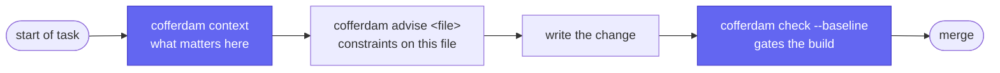
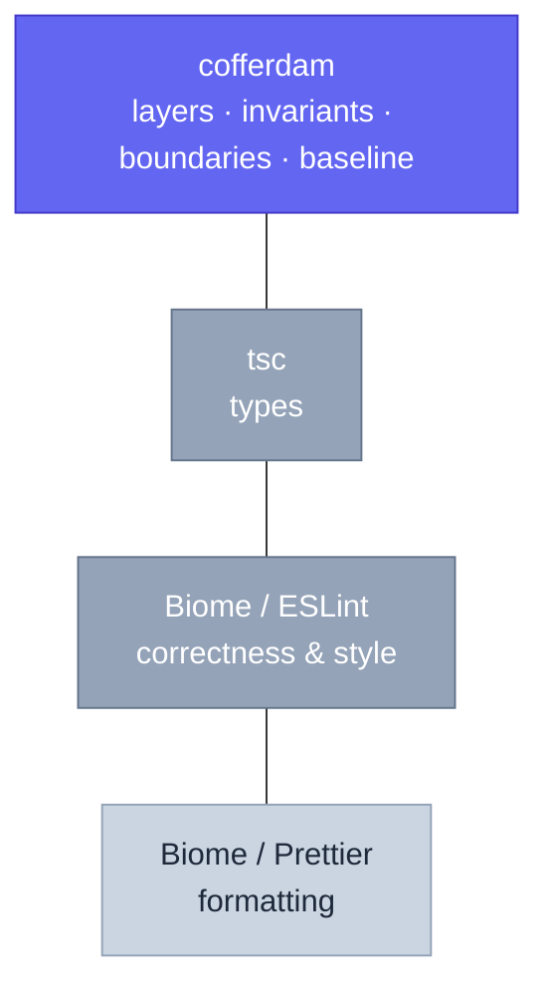

# cofferdam

> One command tells your agent what it needs to know before it touches your repo — and guarantees the debt only goes down.

Cofferdam is a software-architecture analyzer for TypeScript with a Rust core.

Linters read code after it is written and judge it a line at a time. Cofferdam
works a level up, on the questions a linter cannot answer: which modules may
import which, what is frozen, what is public API, how complex a file may get,
and how much known debt the team has agreed to tolerate. Those rules are
declared once in `cofferdam.invariants.toml`, enforced in CI, and handed to AI
coding agents before they write.

Findings fall into five categories — **Consistency**, **Design**,
**Readability**, **Refactor**, **Warning** — and are priority-sorted within
each. The category model is inspired by Elixir's
[Credo](https://github.com/rrrene/credo).

## How it fits your workflow

An agent starts a task by asking what matters. `cofferdam context` resolves the
diff and returns a token-budgeted digest: findings scoped to the change, blast
radius, how sibling files solved the same problem, and any curated knowledge
notes that apply. It is advisory and always exits 0.



Cofferdam does not replace your formatter or linter. It sits above them.



Run `cofferdam doctor` and it will name the built-in style checks that
double-report against a Biome or ESLint config it finds, so you can turn them
off.

## Install

```sh
npm install --save-dev @cofferdam/cofferdam
```

`pnpm add -D` and `yarn add --dev` work the same way. The `postinstall` script
downloads the prebuilt binary for your platform: Linux x64/arm64 on glibc and
musl, macOS x64/arm64, Windows x64. Node 16+ required.

In CI, one command in any runner with Node:

```sh
npx --yes @cofferdam/cofferdam check
```

## Documentation

Full docs: **<https://tajd.github.io/cofferdam>**

| | |
|---|---|
| [`context` reference](https://tajd.github.io/cofferdam/reference/context/) | The digest an agent reads first, and its JSON schema |
| [`advise` reference](https://tajd.github.io/cofferdam/reference/advise/) | The per-file envelope agents branch on |
| [Check catalog](https://tajd.github.io/cofferdam/checks/) | Every built-in check, with bad and good examples |
| [CLI reference](https://tajd.github.io/cofferdam/reference/cli/) | Flags and exit codes |
| [CI recipes](https://tajd.github.io/cofferdam/ci-recipes/) | GitHub Actions, GitLab, CircleCI, Drone, pre-commit |
| [Architectural specs](https://tajd.github.io/cofferdam/invariants/) | `cofferdam.invariants.toml`, layers, frozen boundaries |
| [Budgets and ratchet](https://tajd.github.io/cofferdam/budgets/) | Baselines, hard caps, paying debt down |
| [AI agent workflow](https://tajd.github.io/cofferdam/agents/) | Onboarding prompt and `agents --hooks` |
| [MCP server](https://tajd.github.io/cofferdam/mcp/) | advise, check, explain and invariants as tools |
| [llms.txt](https://tajd.github.io/cofferdam/llms.txt) | Machine-readable entry point for agents |

## Languages

TypeScript — TS, TSX, JS, JSX, MJS and CJS, via `oxc` — is the primary surface.
A Rust adapter ships as the second language and polylingual proof. SQL,
infrastructure-as-code and GraphQL adapters follow the same shape. See
[language support](https://tajd.github.io/cofferdam/languages/).

## Building from source

Requires Rust 1.93 or newer.

```sh
git clone https://github.com/TAJD/cofferdam
cd cofferdam
cargo build --workspace
cargo test --workspace
```

The binary lands at `target/debug/cofferdam`. For a release build, add
`--release -p cofferdam-cli`.

Before opening a pull request:

```sh
cargo fmt --all -- --check
cargo clippy --workspace --all-targets -- -D warnings
cargo test --workspace
```

Cofferdam runs against its own source on every pull request, for both the
TypeScript SDK and the Rust workspace. See
[CONTRIBUTING.md](CONTRIBUTING.md) for the contribution workflow and
[MAINTAINERS.md](MAINTAINERS.md#phased-build) for the roadmap.

## Status

Phase 4, in progress.

## Licence

MIT.
