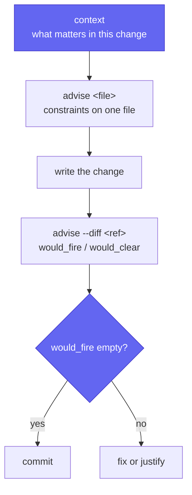

# cofferdam agents

`cofferdam agents` prints a ready-to-paste markdown block that tells an AI
coding agent how to use cofferdam in the current project. The output is
version-pinned so AGENTS.md / CLAUDE.md generators can detect when it is
stale.

## Usage

```sh
cofferdam agents
```

Prints to stdout and exits 0. Append to an existing agent-context file:

```sh
cofferdam agents >> AGENTS.md
```

Or create one from scratch:

```sh
cofferdam agents > AGENTS.md
```

## What the prompt covers

- `cofferdam context` — the default entrypoint into project context an agent
  doesn't already have: a token-budgeted digest of fresh findings, blast
  radius, sibling-file precedent, curated knowledge notes, and inline
  `@cofferdam-context` annotations for whatever the current diff touches.
  Advisory only (never fails the build) — run it at the start of a task or
  right after making a change.
- `cofferdam advise <file>` — layer membership and per-file constraints to read
  **before** editing.
- `cofferdam advise --diff <git-ref>` — pre-flight a proposed change
  (`would_fire` / `would_clear`).
- `cofferdam check --robot` — machine-readable JSON findings; `--format=compact`
  for the smallest footprint.
- `cofferdam.invariants.toml` — the single source of architectural truth.
- `cofferdam explain <Check.Id>` — full rationale for any check.
- GitHub issues URL for reporting false positives, crashes, and confusing output.
- Pointer to the MCP server (`cofferdam-mcp`) exposing the same workflow as tools.

## Detecting staleness

The output header includes the cofferdam version:

```
# cofferdam agents — v0.3.6
```

When you upgrade cofferdam, re-run `cofferdam agents` and diff against the
committed copy to pick up new workflow guidance.

## How the commands relate

Start with `context`. It is the only command that answers "what should I care
about here?", and everything else follows from what it returns.



Two of these answer questions rather than run checks. `advise` is a projection
of the rules — it reports what applies to a file whether or not the current code
breaks it. `context` is advisory and always exits 0. Neither gates anything.

`check` is the one that gates. In CI it reads the baseline, so it fails on new
findings only; budgets ratchet down as debt is paid. See
[budgets and ratchet](/budgets).

## Wiring it in so it's automatic

Under hooks, `advise` runs on its own — the agent's job is just to *read*
the output, not to remember to invoke the CLI. Generate the recipe for your
tool with:

```sh
cofferdam agents --hooks
```

### Claude Code (`.claude/settings.json`)

`PreToolUse` fires before `Edit`/`Write`/`MultiEdit`; `Stop` fires when
Claude finishes responding and gives a pre-commit-style pre-flight:

```json
{
  "hooks": {
    "PreToolUse": [
      {
        "matcher": "Edit|Write|MultiEdit",
        "hooks": [
          {
            "type": "command",
            "command": "FILE=$(jq -r '.tool_input.file_path'); cofferdam advise \"$FILE\" --format=json"
          }
        ]
      }
    ],
    "Stop": [
      {
        "hooks": [
          {
            "type": "command",
            "command": "cofferdam advise --diff HEAD --pretty"
          }
        ]
      }
    ]
  }
}
```

Requires `jq` on `PATH`. Full recipe set — Cursor rules, generic
pre-commit hook, GitHub Actions PR annotations — in
[`docs/hooks.md`](hooks.md).

### MCP (Claude Desktop / Claude Code)

`cofferdam-mcp` exposes `advise`, `advise_diff`, `check`, `explain`, and
`invariants` as MCP tools — byte-for-byte identical to the CLI, so an agent
can complete the whole loop with no bash tool use:

```json
{
  "mcpServers": {
    "cofferdam": {
      "command": "/absolute/path/to/target/release/cofferdam-mcp"
    }
  }
}
```

Full tool list and scope: [`docs/mcp.md`](mcp.md).

## Related

- [`cofferdam context`](reference/context.md) — post-edit knowledge digest;
  the default entrypoint into project context for an agent.
- [`cofferdam advise`](reference/advise.md) — JIT
  per-file advisory used before edits.
- [`cofferdam check --robot`](output-formats.md) — machine-readable findings.
- [`cofferdam.invariants.toml`](invariants.md) — architectural constraints.
- [Agent hooks](hooks.md) — full hook recipes for Claude Code, Cursor, CI.
- [MCP server](mcp.md) — the five tools, byte-for-byte identical to the CLI.
