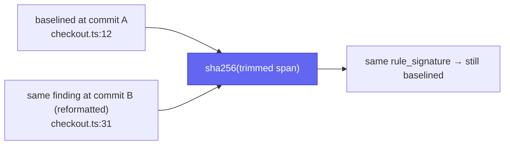
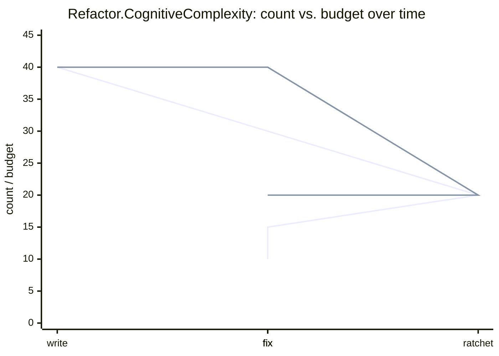

# Budgets & ratchet

A baseline (see [`cofferdam baseline write`](/reference/cli#baseline)) freezes today's findings so CI only fails on *new* ones — but it never shrinks on its own. Debt that's baselined once can sit there forever, and a finding under the `--fail-on` severity threshold never gates CI at all, baselined or not.

Baseline entries are keyed by `(file, check_id, rule_signature)`, where
`rule_signature` hashes the trimmed span rather than the line number — a
reformat or an unrelated edit further up the file does not invalidate an
existing baseline entry:



`[budgets]` is a hard cap on finding counts, independent of severity and baseline status:

```toml
[budgets]
"Refactor.CognitiveComplexity" = 40
Refactor = 120
```

A key is either a dotted check id (caps that one check) or a bare category name (caps the sum across every check in that category — `Consistency`, `Design`, `Readability`, `Refactor`, `Warning`). `cofferdam check` counts **every** finding for a budgeted key — including baselined ones — and fails (exit 1) if the count exceeds the budget, printing which key and by how much:

```
error: budget exceeded for `Refactor.CognitiveComplexity`: 43 finding(s), budget is 40 (fix findings and run `cofferdam baseline ratchet` to lower the budget, or raise it deliberately)
```

This is a second, independent gate from `--fail-on` — a budget overage fails the build even when every triggering finding is baselined or below the severity threshold.

---

## Ratcheting a budget down

`cofferdam baseline ratchet` re-runs the analyzer, compares the current count for each budgeted key against its `cofferdam.toml` value, and rewrites any key whose current count is *lower* than its budget down to that count. It never raises a budget — a key already at or under its cap is left untouched, so ratchet can't be used to quietly relax a gate.

```bash
cofferdam baseline ratchet          # rewrites cofferdam.toml in place
cofferdam baseline ratchet --dry-run --robot   # preview without writing
```

Run it after paying down debt to lock in the improvement: a regression back above the new, lower budget fails CI even if it would otherwise still be under the *old* one.

---

## Baseline hygiene: `baseline prune`

Baseline entries accumulate `(file, check_id, rule_signature)` rows that never get revisited once fixed — a stale entry for a deleted file, a renamed check, or a since-fixed finding just sits in `.cofferdam/baseline.json` forever. `cofferdam baseline prune` removes entries that no longer match any finding from a fresh analysis run:

```bash
cofferdam baseline prune             # removes stale entries, rewrites the baseline
cofferdam baseline prune --dry-run   # lists stale entries, writes nothing
cofferdam baseline prune --check     # same list; exits 1 if any exist (CI gate)
```

`--check` is the one to wire into CI if you want baseline hygiene enforced — it never writes, so it's safe in a read-only checkout.

---

## The ratchet: budgets only move down

`baseline ratchet` and `[budgets]` compose into one property: the debt
number for a given key can go down over time, or hold — never silently
back up.



The budget line only ever steps down (at `ratchet`) or holds — never up.
A regression that pushes `count` back above the current `budget` fails CI
even though it would still be under an earlier, higher value.

That's the mechanism that makes debt monotone by construction, not by
discipline.

## Trend tracking

`cofferdam check --trend` appends one `{date, category, count}` JSON row per category to `.cofferdam/trend.jsonl` on every run — the same category counts `[budgets]` uses, including baselined findings. It's purely additive: no rendering, no dashboard, no retention policy. Point an external tool (a notebook, a small script, a BI import) at the JSONL file if you want a chart.
