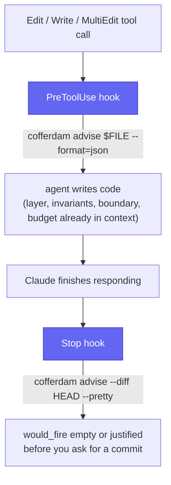

# Agent hooks

Recipes for wiring `cofferdam advise` into an agent's edit loop, so constraints surface
automatically instead of depending on the agent remembering to run the CLI. Rules arrive by
plumbing, not by hoping the agent read AGENTS.md:



Generate the Claude Code fragment (plus Cursor/pre-commit equivalents as comments) with:

```sh
cofferdam agents --hooks
```

## Claude Code (`.claude/settings.json`)

`PreToolUse` fires before `Edit`/`Write`/`MultiEdit` tool calls. The hook receives the tool
call as JSON on stdin — `tool_input.file_path` is the target file — and prints the advisory
so the agent sees layer/invariant constraints before writing code. `Stop` fires when Claude
finishes responding; running `advise --diff HEAD` there is a pre-commit-style pre-flight
check that catches regressions before you ask for a commit.

```json
{
  "hooks": {
    "PreToolUse": [
      {
        "matcher": "Edit|Write|MultiEdit",
        "hooks": [
          {
            "type": "command",
            "command": "FILE=$(jq -r '.tool_input.file_path'); cofferdam advise \"$FILE\" --format=json"
          }
        ]
      }
    ],
    "Stop": [
      {
        "hooks": [
          {
            "type": "command",
            "command": "cofferdam advise --diff HEAD --pretty"
          }
        ]
      }
    ]
  }
}
```

Requires `jq` on PATH to extract `file_path` from the hook's stdin JSON.

## Cursor (`.cursor/rules`)

Cursor rules are prose instructions, not JSON hooks — paste this into your rules file:

```
Before editing a file, run `cofferdam advise <file> --format=json` and respect the
returned layer/invariant constraints. Before finishing a task, run
`cofferdam advise --diff HEAD --pretty` and resolve any would_fire entries.
```

## Generic pre-commit hook (`.git/hooks/pre-commit`)

```sh
#!/bin/sh
cofferdam advise --diff HEAD --fail-on=high
```

`--fail-on=high` exits 1 (blocking the commit) when any `would_fire` entry is high severity
or above. `would_clear` never gates — a change that only clears findings should never block.

## GitHub Actions: annotate PRs with `would_fire`

Two complementary CI recipes:

- Full-repo SARIF upload via `cofferdam check --format=sarif` — the existing recipe in
  [ci-recipes.md §6](ci-recipes.md#6-sarif-upload-to-github-code-scanning) renders findings on
  the **Security** tab and inline on the diff for every check in the repo.
- `advise --diff` scoped to the PR's changed lines — cheaper per-PR feedback that only
  reports what the PR itself introduces or clears, surfaced as native GitHub Actions
  annotations (no SARIF viewer required):

```yaml
# .github/workflows/cofferdam-advise-diff.yml
name: cofferdam advise --diff
on:
  pull_request:

permissions:
  contents: read

jobs:
  advise-diff:
    runs-on: ubuntu-latest
    steps:
      - uses: actions/checkout@v4
        with:
          fetch-depth: 0 # advise --diff needs history to resolve origin/main

      - name: Install cofferdam
        run: npm install -g @cofferdam/cofferdam

      - name: Run advise --diff and annotate
        run: |
          cofferdam advise --diff origin/main > diff.json
          jq -r '.would_fire[] | "::warning file=\(.file),line=\(.line),col=\(.column)::\(.check_id): \(.message)"' diff.json
```

`jq`'s `::warning file=...,line=...,col=...::message` output is a
[GitHub Actions workflow command](https://docs.github.com/en/actions/using-workflows/workflow-commands-for-github-actions#setting-a-warning-message)
— GitHub renders one inline annotation per `would_fire` entry directly on the PR diff, no
SARIF upload or extra permissions needed.
