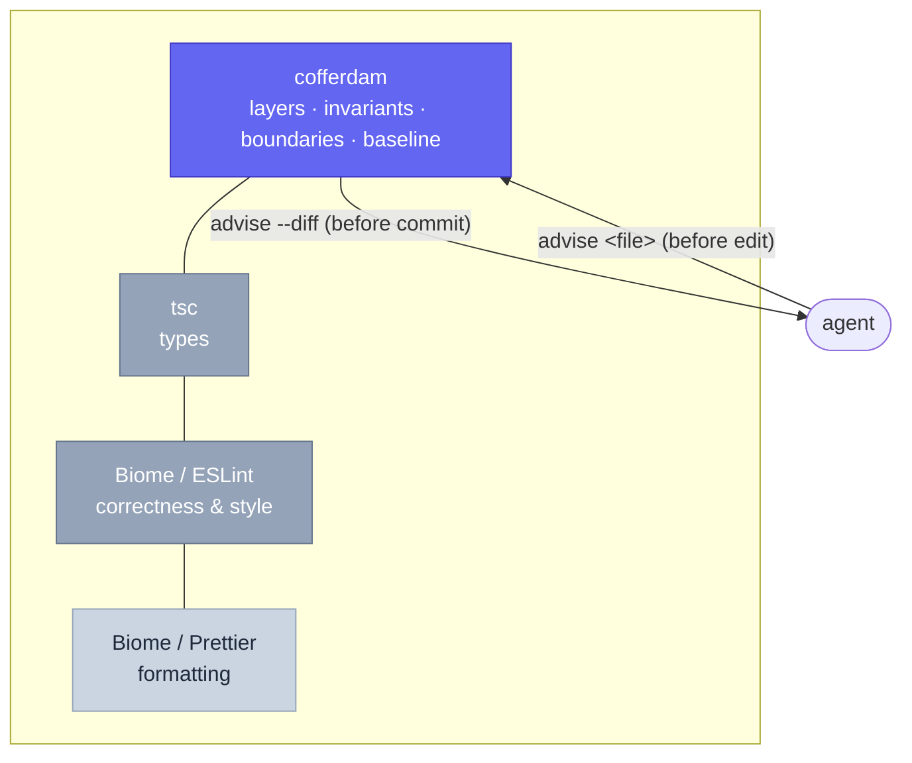
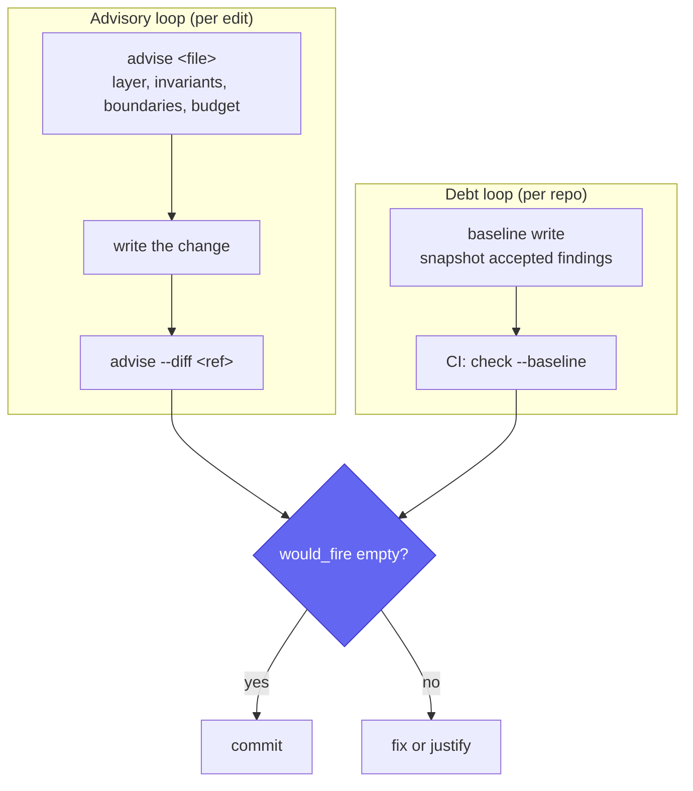
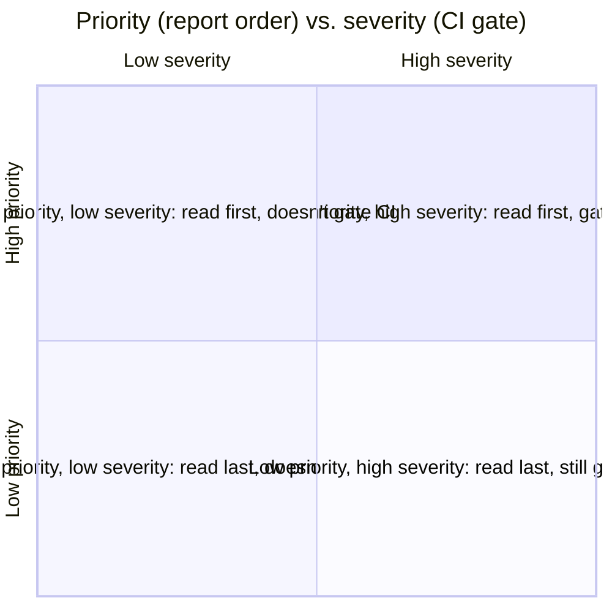

A software-architecture analyzer for TypeScript with a Rust core. Layer rules,
frozen boundaries, import invariants, complexity budgets — declared once in
`cofferdam.invariants.toml`, enforced in CI, and *advised* to AI coding agents
just-in-time.

## Where cofferdam sits

Cofferdam is not a replacement for your formatter or linter. Biome or ESLint
own correctness and style at the line level; `tsc` owns types. Cofferdam sits
above them and owns the *project* level: which modules may import which,
what's frozen, what's public API, how complex a file may get, and how much
known debt the team has agreed to tolerate. Run it alongside Biome, not
instead of it.



The agent arrow touches only the top layer: `cofferdam advise` before the
edit, `cofferdam advise --diff` before the commit. Everything below is
someone else's job, done well already.

## The two loops

**The advisory loop** is for the edit. Before an agent (or you) touches a
file, `cofferdam advise` returns the constraints that apply to *that file*:
its layer and what it may import, whether it's frozen, whether it's public
API, its remaining complexity budget. After the change, `cofferdam advise
--diff <ref>` pre-flights the working tree: `would_fire` should be empty or
justified before anything is committed.

**The debt loop** is for the repo. `cofferdam baseline` snapshots today's
accepted findings so CI only fails on *new* ones; budgets ratchet downward as
debt is paid; nothing regresses silently.



Both loops answer to the same question at the join: is there anything new,
and is it acceptable? [Full advisory reference →](/reference/advise)

## See it work

```sh
$ cofferdam advise src/app/checkout.ts
src/app/checkout.ts
  layer: app          public_api: no
  Design.LayerViolation      imports must target layer(s) [domain, infra]
  Design.InvariantViolation  "no-direct-db-access": must not import src/infra/db
  Design.BoundaryFrozen      not frozen
  Refactor.CognitiveComplexity  limit 15

$ cofferdam advise --diff main
would_fire: 1
  src/app/checkout.ts:12  imports src/infra/db from layer `app`  (Design.InvariantViolation)
would_clear: 0
```

An agent reads the first block before it writes a line, and the second
before it asks you for a commit. Nothing here required parsing a report —
`advise` is a projection of the rules, not a run of the checks.

## Priority sorts, severity gates

Two independent axes: priority is computed and decides what to look at
first; severity is configured and decides what fails the build.



Full breakdown: [output formats →](/output-formats)

## Already running Biome or ESLint? Good — keep them.

Cofferdam's built-in style checks (quotes, `===`, `console.log`, line length)
exist for repos with no linter at all; if `cofferdam doctor` finds a
`biome.json` or ESLint config it will tell you which checks to disable to
avoid double-reporting. What Biome and ESLint don't do — and cofferdam does
— is declarative layer rules, frozen boundaries, named import invariants, a
baseline-and-ratchet debt workflow, and a pre-edit advisory for agents. (Biome
2 does have `noImportCycles` and `noPrivateImports` now — the differentiator
isn't cycle detection alone, it's the invariants-spec + baseline + advise
combination.)

## Built for agents, not bolted on

- **`llms.txt` + `checks.json`** — machine-readable everything, versioned
  schemas. [llms.txt →](/cofferdam/llms.txt) · [checks.json →](/cofferdam/checks.json)
- **MCP server** — `advise`, `advise_diff`, `check`, `explain`, and
  `invariants` as tools, byte-for-byte identical to the CLI. [MCP reference →](/mcp)
- **Hooks, one command** — `cofferdam agents --hooks` emits a paste-ready
  Claude Code `settings.json` fragment (plus Cursor and pre-commit
  equivalents). [Hooks recipes →](/hooks)

## Why the name

A cofferdam is a temporary watertight enclosure that lets you repair a hull
below the waterline without draining the harbour — seal off the water, work
dry inside, pump it out gradually. That's the baseline workflow, exactly.
