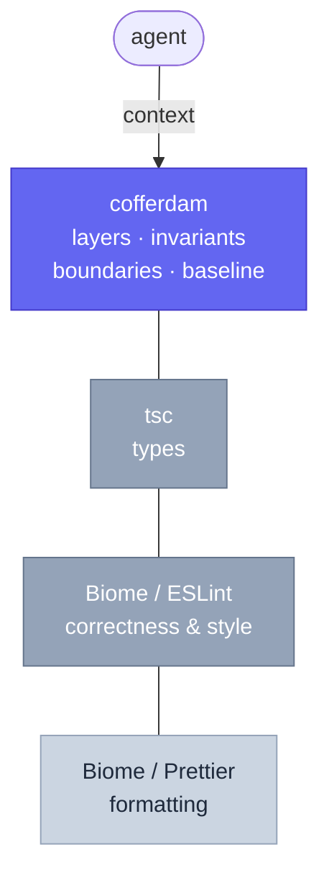

A software-architecture analyzer for TypeScript with a Rust core. Layer rules,
frozen boundaries, import invariants and complexity budgets are declared once in
`cofferdam.invariants.toml`, enforced in CI, and handed to AI coding agents
just-in-time.

## Start with `cofferdam context`

An agent opening an unfamiliar repository has the same problem every new
engineer has: it does not know which of the thousand things it could look at
matter. `cofferdam context` answers that in one call.

```sh
cofferdam context
```

It resolves the working-tree diff and returns a token-budgeted digest of what
that change touches — findings scoped to the delta, the blast radius of the
edited symbols, how sibling files solved the same problem, and any curated
knowledge notes that apply. It is advisory and always exits 0, so it is safe to
put at the top of every task without a fallback path.

This is the entry point. Everything else in cofferdam is reachable from what the
digest tells you.

## The digest, as an API

`--robot` returns the same digest as JSON. Agents branch on it directly; there
is no report to parse.

```json
{
  "schema_version": 1,
  "changed_files": ["src/domain/order.ts"],
  "items": [
    {
      "check_id": "Context.BlastRadius",
      "title": "3 file(s) import src/domain/order.ts",
      "body": "src/api/checkout.ts, src/api/refund.ts, src/jobs/reconcile.ts",
      "score": 70,
      "pinned": false,
      "explain": "src/domain/order.ts is imported by 3 file(s) in the project graph"
    }
  ],
  "omitted": 0,
  "budget": 2000,
  "spent": 41
}
```

To find the next thing worth working on, sort `items` by `score` and read
`explain` before `body`. Four fields carry the signal:

| Field | What it tells you |
|---|---|
| `score` | Rank. The highest-scoring item is the one to act on first. |
| `check_id` | Which provider fired: `Context.Findings`, `Context.BlastRadius`, `Context.Precedent`, `Context.Knowledge` or `Context.Annotations`. Weight or filter by source. |
| `pinned` | `true` means the item survived budget truncation deliberately — a real finding, or a note marked `priority: high`. Never treat a pinned item as filler. |
| `explain` | Why this item fired: the selector that matched, the import edge, the distance. Read it first when deciding whether an item is relevant. |
| `omitted` | Non-zero means content was cut to fit the budget. Raise `--budget` before concluding nothing else matters. |

From a high-scoring item you have somewhere to go: `cofferdam advise <file>` for
the constraints on a specific file, `cofferdam explain <CheckId>` for what a
finding means, `cofferdam check` for the full report.

[Full context reference →](/reference/context)

## Where cofferdam sits

Cofferdam does not replace your formatter or linter. Biome and ESLint own
correctness and style at the line level; `tsc` owns types. Cofferdam sits above
them and owns the *project* level: which modules may import which, what is
frozen, what is public API, how complex a file may get, and how much known debt
the team has agreed to tolerate. Run it alongside Biome, not instead of it.



The agent talks to the top layer only. Everything below it is someone else's
job, already done well.

## Priority sorts, severity gates

Two independent axes. Priority is computed and decides what to read first;
severity is configured and decides what fails the build. A finding can be
urgent to read and harmless to ship, or dull and still blocking.

| | Low severity | High severity |
|---|---|---|
| **High priority** | Read first. Does not gate CI. | Read first. Gates CI. |
| **Low priority** | Read last. Does not gate CI. | Read last. Still gates CI. |

Full breakdown: [output formats →](/output-formats)

## Already running Biome or ESLint? Keep them

Cofferdam's built-in style checks — quotes, `===`, `console.log`, line length —
exist for repos with no linter at all. Run `cofferdam doctor` and it will name
the checks that double-report against a `biome.json` or ESLint config it finds,
so you can disable them.

What Biome and ESLint do not do, and cofferdam does, is declarative layer rules,
frozen boundaries, named import invariants, a baseline-and-ratchet debt
workflow, and a pre-edit advisory for agents. Biome 2 has `noImportCycles` and
`noPrivateImports`, so the differentiator is not cycle detection alone. It is
the invariants spec, the baseline and `advise` working together.

## Debt only goes down

`cofferdam baseline` snapshots the findings a repo already has, so CI fails on
new ones only. Budgets ratchet downward as debt is paid. Nothing regresses
quietly, and adopting cofferdam on a legacy codebase does not turn CI red on day
one. [Budgets and ratchet →](/budgets)

## Built for agents, not bolted on

- **`cofferdam context`** — the first thing an agent runs on a task, described
  above. [Reference →](/reference/context)
- **`cofferdam advise`** — the constraints on one file, before the edit: its
  layer and what it may import, whether it is frozen or public API, its
  remaining complexity budget. A projection of the rules, not a run of the
  checks. [Reference →](/reference/advise)
- **`llms.txt` + `checks.json`** — machine-readable everything, versioned
  schemas. [llms.txt →](/cofferdam/llms.txt) · [checks.json →](/cofferdam/checks.json)
- **MCP server** — `advise`, `advise_diff`, `check`, `explain` and `invariants`
  as tools, byte-for-byte identical to the CLI. [MCP reference →](/mcp)
- **Hooks, one command** — `cofferdam agents --hooks` emits a paste-ready Claude
  Code `settings.json` fragment, plus Cursor and pre-commit equivalents.
  [Hooks recipes →](/hooks)

## Why the name

A cofferdam is a temporary watertight enclosure that lets you repair a hull
below the waterline without draining the harbour: seal off the water, work dry
inside, pump it out gradually. That is the baseline workflow, exactly.
