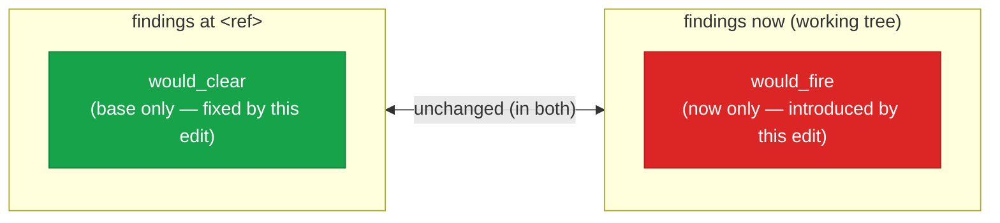
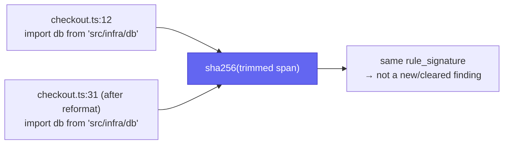

# `cofferdam advise` — JIT advisory for agents

`cofferdam advise <path>` emits the rules that **apply to** a file or
directory, independent of whether any current code violates them. It is
designed for agentic edit loops: an LLM agent shells out before editing
a file, gets back the file's layer membership and per-rule constraints,
and adjusts its plan before writing code.

It is a **static projection** of your config, not a check run:

- Does not parse the file.
- Does not run the engine or any check logic.
- Does not build the project graph.

Each finding is `(CheckMeta + resolved options + layer state)` for the
requested path. Single-file invocations finish well under 200 ms — fast
enough to put on the hot path of a code-editing prompt.

For finding-level output (what's wrong with the code today), use
[`cofferdam check`](./cli.md#cofferdam-check) instead. `advise` is the
forward-looking question — "what should the next edit respect?"

## Quick start

```bash
# What rules apply to this file? JSON for an agent / pipeline;
# --robot defaults --format to json.
cofferdam advise --robot src/ui/Button.tsx
```

```json
{
  "schema_version": 1,
  "files": [
    {
      "path": "src/ui/Button.tsx",
      "layer": "ui",
      "public_api": false,
      "constraints": [
        {
          "rule": "Design.LayerViolation",
          "category": "design",
          "severity": "high",
          "applies": "imports must target layer(s) [domain]",
          "allowed": ["domain"],
          "forbidden": ["infra"]
        }
      ]
    }
  ]
}
```

Schema: [`/schemas/advise-v1.json`](/cofferdam/schemas/advise-v1.json) — additive-only
within `schema_version: 1`; full field reference below.

## What agents should branch on

Before writing or committing, key off these fields rather than reading the
whole envelope:

| Field | Where | Branch on |
|---|---|---|
| `layer` | per file | Which `[layers]` group the edit falls in — determines which `forbidden`/`allowed` lists apply. |
| `frozen` | `Design.BoundaryFrozen` constraint | `true` → do not modify this file without addressing `reason`. |
| `forbidden` | `Design.LayerViolation` constraint | Layers this file must not import from — check new imports against this before writing them. |
| `would_fire` | `--diff` output | Non-empty → the working tree introduces a new violation; resolve or justify before asking for a commit. |

## Quick start (more forms)

```bash
# Glob — quote it so the shell does not expand.
cofferdam advise 'src/domain/**/*.ts'

# Whole project (defaults to walking `.`).
cofferdam advise --robot --pretty
```

## Flags

`advise` accepts the same set of discovery and config flags as `check`,
plus the format pair shared with the rest of the CLI. The full reference
is in [the CLI page](./cli.md#cofferdam-advise); the load-bearing ones
are:

| Flag | Effect |
|---|---|
| `[PATHS]...` | Files, directories, or globs. Defaults to `.`. Shell expansion is honoured first; the CLI also runs its own globset matcher for quoted patterns. |
| `--format <text\|json>` | Output format. Default `text`; with `--robot` and no explicit `--format`, defaults to `json`. |
| `--robot` | Switch the default to JSON. Token-economical for AI agents. |
| `--pretty` | Pretty-print JSON. |
| `--config <PATH>` | Path to a config file. Defaults to walking up from the analyzed target path, falling back to CWD, until one is found. |
| `--no-config` | Disable config discovery entirely — every check uses its built-in defaults. |
| `--hidden` | Walk hidden files/directories. |
| `--no-ignore` | Disable `.gitignore` / `.cofferdamignore` filtering. |

## Text output

```text
src/ui/Button.tsx
  Layer:       ui
  Public API:  no
  Constraints:
    Readability.MaxLineLength (readability, severity low) — limit 120
    Readability.MaxFunctionLength (readability, severity low) — limit 50
    Design.MaxParameters (design, severity medium) — limit 5
    Design.LayerViolation (design, severity high) — imports must target layer(s) [domain]
      forbidden layers: infra
    Refactor.DuplicateBlock (refactor, severity medium) — min_statements=6, min_chars=80, include_tokens=false, include_ast=true
    Warning.TripleEquals (warning, severity high) — `==` and `!=` perform type coercion …
    …
```

For each file:

- `Layer` — which `[layers]` group the file falls into (or `(none)`).
- `Public API` — reserved for the upcoming public-API allowlist; `no`
  for every file today.
- `Constraints` — one line per applicable rule. The `applies` line is
  the load-bearing summary an agent should pay attention to (a `limit`,
  a list of allowed layer targets, etc.). The `forbidden layers:` line
  appears only for `Design.LayerViolation` when at least one layer is
  off-limits.

## JSON output (for agents)

`cofferdam advise --robot --pretty path/to/file.ts` produces a
schema-versioned envelope: `{schema_version, files}`, where `files` is
one object per requested file, each with a `constraints` array. Stable
keys within a `schema_version`; additional optional keys may be added
in future minor releases. Published schema: `/schemas/advise-v1.json`.

> **Breaking change (CD-65, schema_version 1):** prior releases emitted
> a bare JSON array with no envelope. Any consumer parsing the top-level
> value as an array must now read `.files` instead.

```json
{
  "schema_version": 1,
  "files": [
  {
    "path": "src/ui/Button.tsx",
    "layer": "ui",
    "public_api": false,
    "constraints": [
      {
        "rule": "Readability.MaxLineLength",
        "category": "readability",
        "severity": "low",
        "applies": "limit 120",
        "rationale": "Lines longer than the configured limit are harder to scan and review.",
        "parameters": { "limit": 120 }
      },
      {
        "rule": "Design.LayerViolation",
        "category": "design",
        "severity": "high",
        "applies": "imports must target layer(s) [domain]",
        "rationale": "An import crosses a declared architectural layer in a direction not permitted by [layers].allow.",
        "allowed": ["domain"],
        "forbidden": ["infra"]
      },
      {
        "rule": "Design.OrphanExport",
        "category": "design",
        "severity": "medium",
        "applies": "every export must be imported somewhere in-project",
        "rationale": "An exported symbol is never imported anywhere in the project. Likely dead code left over from a refactor.",
        "parameters": {
          "include_type_only": false,
          "test_file_patterns": [".test.", ".spec.", "_test.", "_spec.", "/__tests__/", "/__mocks__/"],
          "framework_entry_patterns": ["/page.", "/layout.", "/route.", "/middleware.", "/next.config." /* … */]
        },
        "exempt": false
      }
    ]
  }
  ]
}
```

### Field reference

Envelope:

| Key | Type | Notes |
|---|---|---|
| `schema_version` | integer | `1` today. Bumped only on a breaking shape change. |
| `files` | array | One entry per requested file. |

Per file:

| Key | Type | Notes |
|---|---|---|
| `path` | string | Forward-slashed regardless of platform. |
| `layer` | string \| omitted | The `[layers]` group the file matches. Omitted when no layer matches. |
| `public_api` | bool | Reserved for the upcoming public-API allowlist. Always `false` today. |
| `constraints` | array | One entry per applicable rule. |

Per constraint:

| Key | Type | Notes |
|---|---|---|
| `rule` | string | The check id (e.g. `Design.LayerViolation`). Stable. |
| `category` | string | One of `consistency`, `design`, `readability`, `refactor`, `warning`. |
| `severity` | string | `info` \| `low` \| `medium` \| `high` \| `critical`. Reflects per-check severity overrides from config. |
| `applies` | string | The single most agent-actionable summary — a `limit`, a layer-allowlist, etc. Prefer this over `rationale` when sizing tokens. |
| `rationale` | string | Long-form explanation from `CheckMeta::explanation`. |
| `parameters` | object \| omitted | Resolved option values for the check. Omitted for checks with no options. |
| `allowed` | string[] \| omitted | `Design.LayerViolation` only — layers this file may import from. |
| `forbidden` | string[] \| omitted | `Design.LayerViolation` only — layers this file may **not** import from. |
| `exempt` | bool \| omitted | `Design.OrphanExport` only — `true` when the file matches a framework-entry or test pattern. |
| `exempt_reason` | string \| omitted | Set when `exempt: true`. |

## Diff mode — `--diff <git-ref>`

`cofferdam advise --diff <git-ref>` flips the question from
"what does my next edit need to respect?" to
**"what would *this* in-progress edit do?"** It runs the full check
engine twice — once against the source as it existed at `<git-ref>`
(materialised via `git show <ref>:<path>`), once against the working
tree — and reports two sets:

- `would_fire` — rules that fire on the proposed change but not on the
  baseline. The new violations the diff introduces.
- `would_clear` — rules that fire on the baseline but not on the
  proposed change. Regressions the edit cleans up.

Both are a set difference over the same finding keys (`file`, `check_id`,
`rule_signature`), computed both ways:



`exit 0 ⟺ would_fire ∩ severity≥--fail-on = ∅` — `would_clear` never
gates; a change that only clears findings should never fail CI.

For agentic edit loops this collapses
"write → check → fix → repeat" to "advise --diff → done" whenever the
draft is rule-compliant on the first pass.

```bash
# Did my working-tree changes vs main introduce any new findings?
cofferdam advise --diff main

# CI gate — exit 1 if any would_fire entry is medium or above.
cofferdam advise --diff main --fail-on medium
```

Output is always JSON in diff mode (`--format` is ignored). Findings
are keyed by `(file, check_id, rule_signature)` where `rule_signature`
is the same SHA-256-of-trimmed-span used by the baseline subsystem, so
reformats and line shifts do **not** show up as spurious entries:



The signature hashes the trimmed span, not the line number — so a
reformat or an unrelated diff further up the file never produces a
phantom `would_fire`/`would_clear` entry for a finding that didn't
actually change.

```json
{
  "ref": "main",
  "would_fire": [
    {
      "file": "src/api/route.ts",
      "check_id": "Warning.TripleEquals",
      "severity": "medium",
      "line": 42,
      "column": 11,
      "message": "use === instead of ==; == performs type coercion"
    }
  ],
  "would_clear": [],
  "summary": { "would_fire": 1, "would_clear": 0 }
}
```

### Exit codes

| Mode | Exit |
|---|---|
| Default (no `--fail-on`) | `0` regardless of findings — the verdict is in the JSON. |
| `--fail-on=<level>` and any `would_fire` entry is at or above `<level>` | `1` |
| `--fail-on=<level>` and no `would_fire` entry is at or above `<level>` | `0` |
| `--fail-on` only inspects `would_fire` — `would_clear` never gates. | |

### Scope

The file set is the working-tree-vs-`<ref>` diff, filtered to TypeScript
extensions (`.ts`, `.tsx`, `.js`, `.jsx`, `.mts`, `.cts`) and any
explicit `[paths]...` arg. Renames are counted as add+delete in v0.

### Limitations

- **Single ref.** No `--diff a..b` form yet; the comparison is always
  "working tree vs `<ref>`."

## Why a separate command (vs. `check`)

`cofferdam check` answers "what's wrong with the code in this file?"
`cofferdam advise` answers "what does my next edit need to respect?"

For an agent that's about to rewrite a file, the second question is the
useful one — a rules listing is shorter than a parse-and-analyze run,
shows constraints that aren't currently violated (so the agent doesn't
introduce them), and is cheap enough to call on every edit hop.

## Limitations

- `Design.LayerViolation` is the only check whose advisory output
  includes file-level allow/forbid lists today; other graph-aware
  checks render their generic `rationale` until the project graph
  surface lands.
- `public_api` is always `false` until the public-API allowlist (cd-9ph
  family) ships.
- The schema is additive — fields may be added in minor versions, but
  existing keys keep their meaning.
