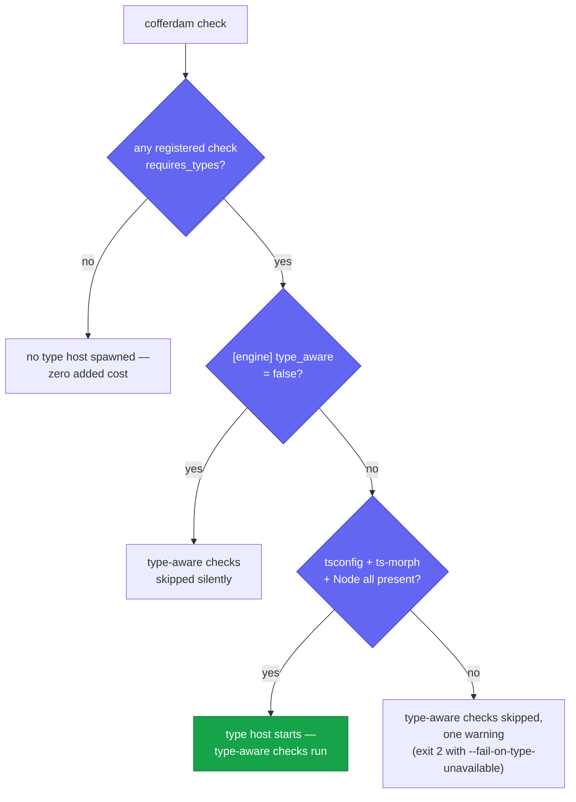

# Type-aware checks

Most cofferdam checks work purely from the syntax tree — fast, native
Rust, no runtime needed. A few questions can't be answered from syntax
alone: *is this variable's declared type actually nullable? does this
guard ever change the outcome?* Those need TypeScript's **type system**,
which lives in the TS compiler, not in cofferdam's parser.

Checks that need type information are **type-aware**. They declare
`requires_types` and are routed through a Node-side
[ts-morph](https://ts-morph.com) **type host** — a worker process that
holds an open TypeScript `Project` and answers type queries over a
JSON-RPC channel. The wire protocol is documented in
`design/type-host-wire.md`.

The current type-aware built-ins:

- [`Warning.UnusedNullCheck`](/checks/Warning.UnusedNullCheck) — flags an
  equality check against `null`/`undefined` whose other operand's type
  already excludes that value, so the guard is dead code.

This page covers built-in check routing. **Plugin checks** can declare
`requiresTypes: true` too, through the same ts-morph type host — including
`resolveLiteral`, a cross-file query that follows an imported identifier to
its literal value. See the [Author guide](/plugin-sdk-guide#_7-type-aware-checks)
for the plugin-side API and [SEO-grade checking](/seo-checking#_4-type-aware-description-resolved-across-an-import)
for a worked example.

## When the type host runs

cofferdam spawns the type host only when it has to, and skips type-aware
checks — rather than failing — whenever the machinery is absent. The whole
decision is one path:



The rest of this page walks each branch: what the host needs, what it
costs, how to turn it off, and how to make a missing host a hard CI error.

## What a type-aware check needs

A type-aware check only runs when cofferdam can reach a type host. That
requires, in the project under analysis:

1. **A `tsconfig.json`.** cofferdam walks up from the analysis root to
   find it; the ts-morph `Project` is built from it. No tsconfig → the
   check is skipped (no false positives from missing type info).
2. **`ts-morph` installed.** cofferdam ships *without* a bundled
   ts-morph to keep the install lean. Add it to the project you analyse:

   ```bash
   npm install --save-dev ts-morph
   ```

   The host resolves `ts-morph` from the project's own `node_modules`.
   When it can't, cofferdam prints a single warning and skips type-aware
   checks — the rest of the run is unaffected.
3. **A Node runtime** on `PATH` to run the worker.

When all three are present, the worker opens the project once (paying the
init cost up front, not mid-run) and every type-aware check queries it
through the rest of the analysis.

## Cost and when it's paid

The type host is a real Node process with the TS compiler loaded —
roughly 200 MB of RAM and a one-time project-init cost that scales with
project size (sub-second on a handful of files; a few seconds on a few
hundred). cofferdam never pays this cost unless it has to:

- **Auto opt-out.** If no registered check declares `requires_types`, no
  worker is spawned at all — zero added cost. This is automatic; you
  don't configure anything.
- **No tsconfig / no ts-morph.** The worker isn't started; type-aware
  checks are skipped with one warning.

## Turning type-aware checks off

Sometimes you want type-aware checks off even though the machinery is
available — most commonly a CI runner that has no Node runtime and
shouldn't fail or warn over it. Set the opt-out in `cofferdam.toml`:

```toml
[engine]
type_aware = false
```

With `type_aware = false`, cofferdam never spawns the type host and skips
every `requires_types` check silently — no Node, no ts-morph, no warning.
Non-type-aware checks run exactly as before. Omitting the key (or setting
`true`) leaves type-aware checks enabled, subject to the auto opt-out
above.

::: tip CI without Node
If your lint CI image is Rust-only, add `[engine] type_aware = false` to
the config that job uses (or a dedicated one via `--config`). Run the
type-aware checks in a separate Node-equipped job — see the
[CI recipes](/ci-recipes).
:::

## Enforcing type coverage in CI

By default, if the type host cannot start (Node unavailable, ts-morph not
installed, no tsconfig found), cofferdam prints a single warning and
continues — type-aware checks are silently skipped and the run exits 0 on
findings alone. This preserves current behaviour in environments without
Node and avoids breaking CI unexpectedly.

In jobs that **explicitly rely on type-aware coverage** you can turn the
warning into a hard error:

```bash
cofferdam check --fail-on-type-unavailable
```

When this flag is set and a type-aware check is registered but the oracle
could not be installed, cofferdam exits with code 2 and prints a clear
diagnostic. Use it in a dedicated type-aware CI job (one that has Node and
ts-morph available) to catch silent regressions early.

The flag has no effect when:
- No registered check declares `requires_types` (oracle was never needed).
- `[engine] type_aware = false` is set — type-aware checks are explicitly
  disabled, so there is no oracle to fail.

## Disabling a single type-aware check

To keep the type host but silence one check, raise or lower it like any
other — for example bump its severity so it doesn't gate, or scope it out
through your normal suppression flow. The
[`Warning.UnusedNullCheck`](/checks/Warning.UnusedNullCheck) page shows
its configurable severity.
